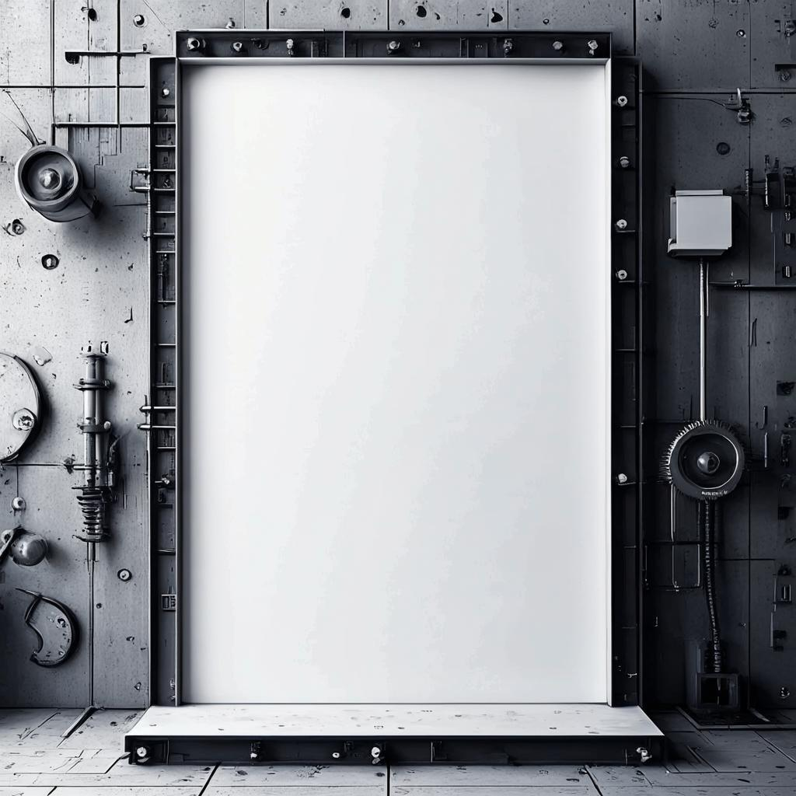
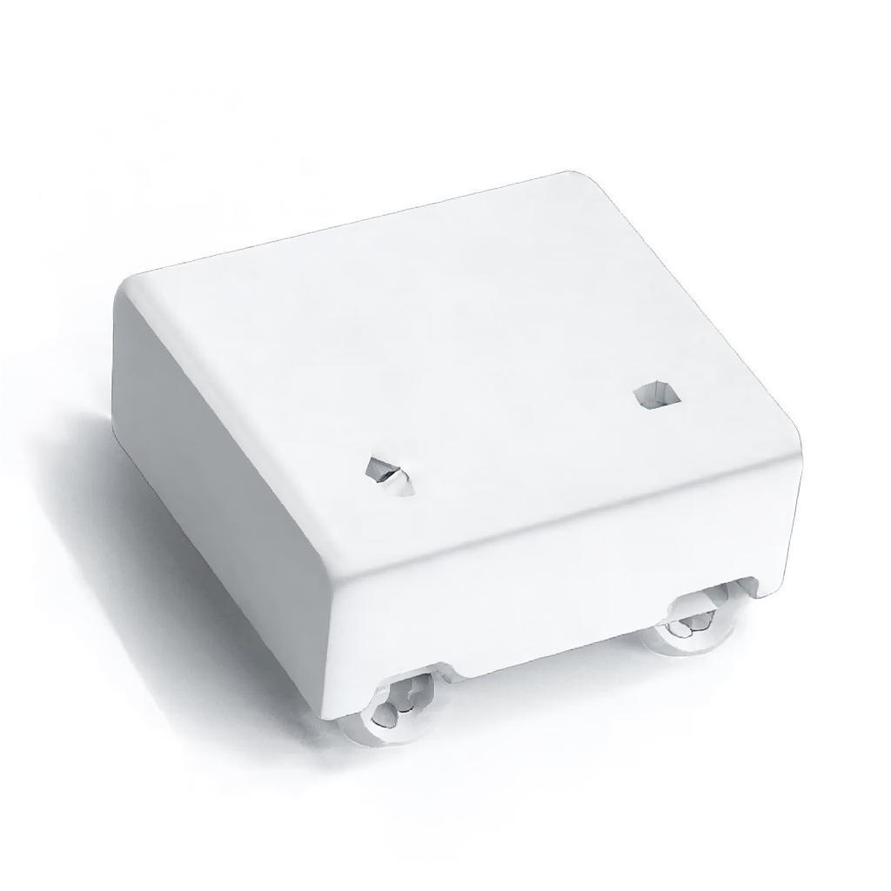

# Industrial Style Guide

> Полное руководство по стилям технической иллюстрации и индустриального минимализма


## Table of Contents

- [О проекте](#о-проекте)
- [Возможности](#возможности)
- [Быстрый старт](#быстрый-старт)
- [Клонирование](#клонирование)
- [Установка](#установка)
- [Запуск](#запуск)
- [Структура сайта](#структура-сайта)
- [Категории стилей](#категории-стилей)
- [ТОП-5 для UI](#топ-5-для-ui)
- [Ключевые понятия](#ключевые-понятия)
- [Технологии](#технологии)
- [Структура проекта](#структура-проекта)
- [Скрипты](#скрипты)
- [Стандарт воспроизводимости](#стандарт-воспроизводимости)
- [Скриншоты](#скриншоты)
- [Лицензия](#лицензия)
- [Автор](#автор)
- [Features](#features)
- [Tech Stack](#tech-stack)
- [Getting Started](#getting-started)
- [License](#license)

## О проекте

Справочник по визуальным стилям технической иллюстрации — от инженерных чертежей до современного UI дизайна. Помогает дизайнерам и инженерам выбрать подходящий стиль для своих проектов.

## Возможности

- **31 стиль** с визуальными примерами
- **6 категорий**: Технические, Карандашные, Минималистичные, Архитектурные, Винтажные, Цифровые
- **Тёмная/светлая тема**
- **Модальный просмотр** изображений
- **ТОП-5 стилей для UI** с рейтингом

## Быстрый старт

```bash
## Клонирование
git clone https://github.com/Sts8987/Industrial-Style-Guide.git
cd Industrial-Style-Guide

## Установка
bun install

## Запуск
bun run dev
```

Откройте [http://localhost:3000](http://localhost:3000) в браузере.

## Структура сайта

```bash
┌─────────────────────────────────────┐
│  HERO — Индустриальный Минимализм   │
├─────────────────────────────────────┤
│  KEY CONCEPTS                       │
│  Чертёж │ Минимализм │ Разница      │
├─────────────────────────────────────┤
│  ★ ИЗБРАННЫЕ ПРИМЕРЫ (6)            │
├─────────────────────────────────────┤
│  КАТАЛОГ СТИЛЕЙ (31)                │
│  [Технические] [Карандашные]        │
│  [Минималистичные] [Архитектурные]  │
│  [Винтажные] [Цифровые]             │
├─────────────────────────────────────┤
│  СРАВНЕНИЕ                          │
│  Чертёж vs Минимализм               │
├─────────────────────────────────────┤
│  ТОП-5 ДЛЯ UI                       │
├─────────────────────────────────────┤
│  FAQ                                │
└─────────────────────────────────────┘
```

## Категории стилей

### Технические (6)
- Blueprint (Синий чертёж)
- Technical Drawing
- Isometric
- Exploded View
- Patent Drawing
- Architectural Drawing

### Карандашные (6)
- Pencil Sketch
- Charcoal
- Ink Drawing
- Pen & Ink
- Graphite Realism
- Conté Crayon

### Минималистичные (6)
- Line Art
- Minimalist Sketch
- Monoline
- Continuous Line
- Wireframe
- Outline Drawing

### Архитектурные (4)
- Architectural Sketch
- Construction Drawing
- Schematic Drawing
- Orthographic Projection

### Винтажные (5)
- Vintage Technical
- Engraving Style
- Botanical Illustration
- Scientific Diagram
- Da Vinci Sketch

### Цифровые (4)
- Low Poly
- Geometric Minimalism
- Flat Design Technical
- Dotted Drawing

## ТОП-5 для UI

| # | Стиль | Оценка | Применение |
|---|-------|--------|------------|
| 1 | Flat Design Technical | 100% | Стандарт индустрии |
| 2 | Line Art | 90% | Empty states, иконки |
| 3 | Monoline | 85% | Логотипы, иконки |
| 4 | Geometric Minimalism | 80% | Лендинги, hero |
| 5 | Isometric | 75% | Инфографика |

## Ключевые понятия

### Чертёж vs Минимализм

| Чертёж | Минимализм |
|--------|------------|
| Документ для производства | Художественный стиль |
| Размеры, допуски, сечения | Только эстетика |
| Для инженеров | Для дизайнеров |
| «Как сделать» | «Как выглядит красиво» |

### Engineering Drawing = Индустриальный чертёж

Это одно и то же. Professional document for manufacturing.

## Технологии

- **Framework**: Next.js 16 (App Router)
- **Language**: TypeScript 5
- **Styling**: Tailwind CSS 4
- **UI Components**: shadcn/ui
- **Icons**: Lucide React
- **Theme**: next-themes

## Структура проекта

```css
src/
├── app/
│   ├── page.tsx        — Главная страница
│   ├── layout.tsx      — Layout с ThemeProvider
│   └── globals.css     — Глобальные стили
├── components/
│   ├── ui/             — shadcn/ui компоненты
│   ├── theme-provider.tsx
│   └── theme-toggle.tsx
└── lib/                — Утилиты

public/
└── styles/             — Изображения стилей (37 файлов)
```

## Скрипты

```bash
bun run dev      # Разработка (порт 3000)
bun run build    # Production сборка
bun run start    # Production сервер
bun run lint     # ESLint проверка
bun run setup    # Инициализация проекта
```

## Стандарт воспроизводимости

Проект соответствует [Z.ai Standard v1.0](https://z.ai):

```bash
git clone + bun install + bun run dev = работает
```

- `.env.example` создан
- `.gitignore` по стандарту
- Нет абсолютных путей
- `package.json` v1.0.0 с `postinstall`

## Скриншоты

### Светлая тема


### Тёмная тема


## Лицензия

MIT

## Автор

Created by [Z.ai](https://z.ai)


**Industrial Style Guide** — выбери правильный стиль для своего проекта.


## Features

- Feature 1 - description
- Feature 2 - description


## Tech Stack

- **Framework** - Next.js
- **Language** - TypeScript
- **Styling** - Tailwind CSS, CSS
- **Libraries** - shadcn/ui
- **Tools** - React


## Getting Started

### Prerequisites

- Node.js 20+ or Bun

### Installation

```bash
git clone https://github.com/stsgs1980/Industrial-Style-Guide.git
cd Industrial-Style-Guide
bun install
```

### Run

```bash
bun run dev
```

## License

[MIT](LICENSE)

---
Built with: Next.js + React + TypeScript + Tailwind CSS
